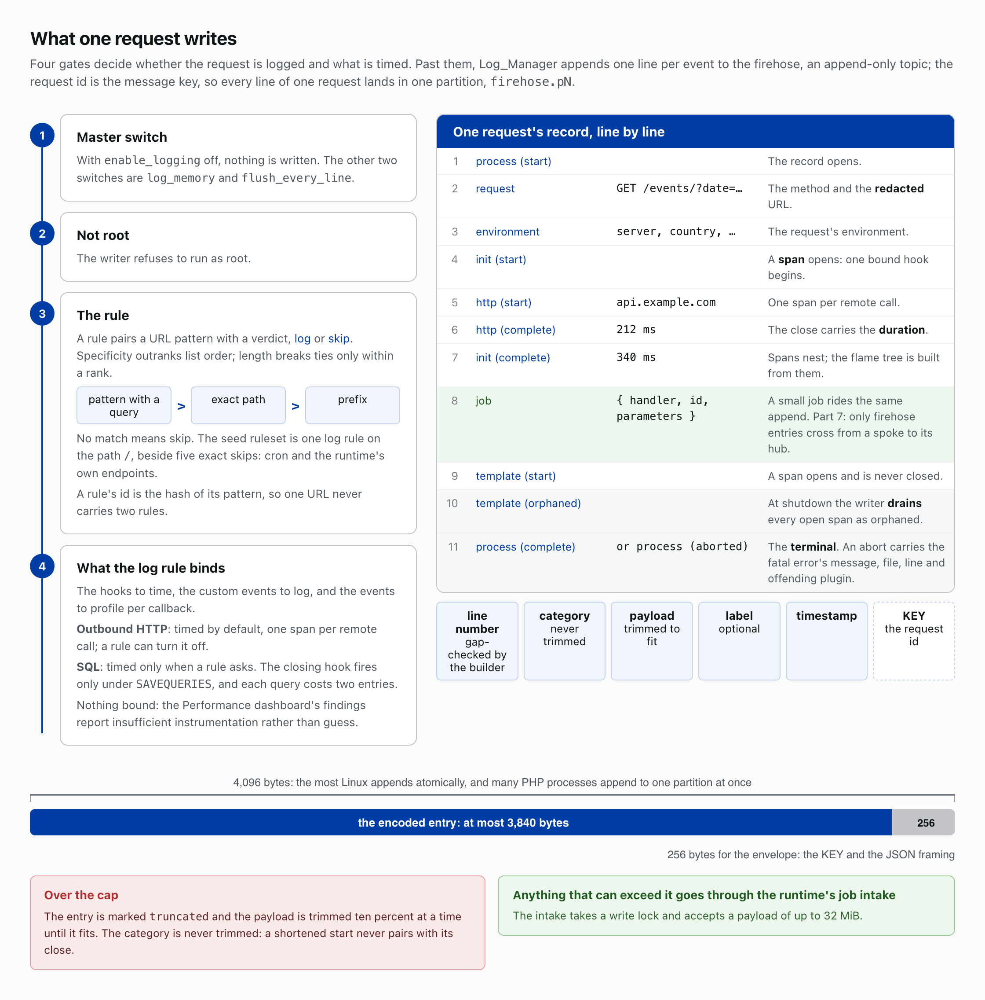
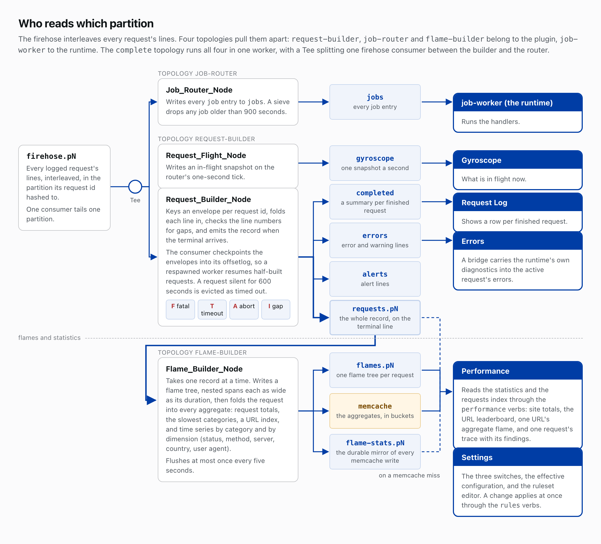
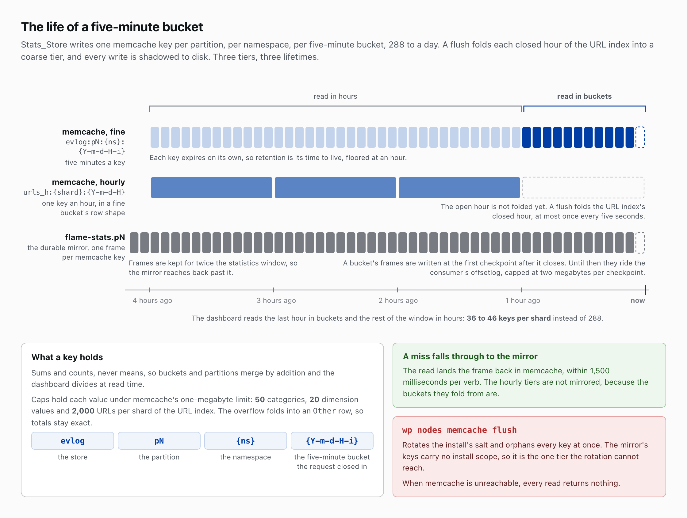

# The Event Logger
*Part 6 of 10 in Newspack Nodes and the Event Logger. Previous: Commands, capabilities and sessions. Next: Hub and spoke.*

Newspack Event Logger Nodes is an application on the runtime: it records what a WordPress request does and how long each part takes. The runtime owns the wiring; the plugin owns the data processing.

## One line per event

The writer sits on the critical path of the request it measures. Log_Manager appends one line per event to the firehose, an append-only topic, and forgets it: it reads nothing, aggregates nothing and waits on no other process.

Four gates stand before the append. `enable_logging` is the master switch. The writer refuses to run as root. A rule pairs a URL pattern with a verdict, log or skip, and specificity outranks list order: a pattern with a query beats an exact path, which beats a prefix, and length breaks ties only within a rank. No match means skip, so the seed ruleset is one log rule on `/` beside five exact skips for cron and the runtime's own endpoints. A rule's id is the hash of its pattern, so one URL never carries two rules.

The fourth gate is what the log rule binds: the hooks to time, the custom events to log and the events to profile per callback. Outbound HTTP is timed by default, one span per remote call, and a rule can turn it off. SQL is timed only when a rule asks, because the closing hook fires only under `SAVEQUERIES` and each query costs two entries. Where nothing is bound, the Performance dashboard's findings report insufficient instrumentation rather than guess.

A message carries a line number, a category, a payload, an optional label and a timestamp, keyed by the request id so one request's lines land in one partition. The record opens with a process start line, a request line naming the method and the redacted URL, and an environment line. Each timed operation is a span: a start line, then a complete line carrying the duration. At shutdown the writer drains every open span as orphaned and writes the terminal, process complete or process aborted, with any fatal error's message, file, line and offending plugin.

Linux appends atomically only up to 4,096 bytes, and many PHP processes append to one partition at once, so the writer holds each encoded entry to 3,840 bytes and leaves 256 for the key and the JSON framing. Over the cap, the entry is marked truncated and its payload trimmed ten percent at a time until it fits; the category is never trimmed, because a shortened start never pairs with its close. Anything that can exceed the cap belongs in the runtime's job intake, which takes a write lock and accepts up to 32 MiB.

## Assembling a request

The firehose interleaves every request's lines. Four topologies pull them apart: request-builder, job-router and flame-builder in the plugin, job-worker in the runtime. One consumer tails one partition.

Assembly happens in the workers, where the request is over and nobody is waiting. Request_Builder_Node keys an envelope per request id, folds each line in, checks the line numbers for gaps, and emits the record to the requests partition when the terminal arrives. A summary of each finished request goes to completed, error and warning lines to errors, and alert lines to alerts; Request_Flight_Node writes an in-flight snapshot to gyroscope on the router's one-second tick. The consumer checkpoints the envelopes into its offsetlog, so a respawned worker resumes half-built requests, and a silent request is evicted as timed out after 600 seconds. Four statuses mark an unclean end, F for a fatal, T for a timeout, A for an abort and I for a gap; they tell you whether a measurement is missing or the request was.

Gyroscope shows what is in flight now, Request Log a row per finished request, and Errors the error lines; a bridge carries the runtime's own diagnostics into the active request's errors. Settings holds the three switches, `enable_logging`, `log_memory` and `flush_every_line`, the effective configuration and the ruleset editor; a change applies at once through the `rules` verbs.

## Flames and statistics

Flame_Builder_Node takes one record from the requests partition at a time, writes a flame tree of nested spans, each as wide as its duration, to the flames partition, then folds the request into every aggregate: request totals, the slowest categories, a URL index, and time series by category and by dimension (status, method, server, country, user agent). Performance reads the statistics and the requests index through the `performance` verbs: site totals, the URL leaderboard, one URL's aggregate flame, and one request's trace with its findings.

The aggregates live in memcache under a key Stats_Store builds from the partition, the namespace and the five-minute bucket the request closes in, `evlog:pN:{ns}:{Y-m-d-H-i}`, 288 to a day. The store keeps sums and counts, never means, so buckets and partitions merge by addition and the dashboard divides at read time. Caps hold each value under memcache's one-megabyte limit: 50 categories, 20 dimension values and 2,000 URLs per shard of the URL index. The overflow lands in an `Other` row, so the totals still add up.

Each key expires on its own, so retention is its time to live, floored at an hour. The builder flushes at most once every five seconds, and a flush folds each closed hour of the URL index into an hourly tier, `urls_h:{shard}:{Y-m-d-H}`, one key an hour in a fine bucket's row shape; the dashboard reads the last hour in buckets and the rest of the window in hours, 36 to 46 keys per shard instead of 288.

## The mirror

When memcache is unreachable every read returns nothing, and `wp nodes memcache flush` rotates the install's salt and orphans every key at once. The durable flame-stats partition makes the flush a routine operation rather than the loss of the whole statistics window. Every memcache write is mirrored there as a frame under a key with no install scope, so the rotation cannot reach it. A bucket's frames are written at the first checkpoint after it closes and kept for twice the statistics window; until that checkpoint they ride the consumer's offsetlog, capped at two megabytes per checkpoint. A read that misses memcache falls through to the mirror and lands the frame back in memcache, within 1,500 milliseconds per verb. The hourly tiers are not mirrored, because the buckets they fold from are.

## Jobs ride the firehose too

Jobs ride the firehose because the append is already paid for, and because only firehose entries cross from a spoke to its hub (Part 7). A job is an entry in the `job` category, so the same append that logs a request can enqueue work. Job_Router_Node writes every job entry to the jobs partition, a sieve drops any job older than 900 seconds, and the runtime's job-worker topology runs the handlers. The `complete` topology runs assembly, flames, routing and dispatch in one worker, with a Tee splitting one firehose consumer between the builder and the router.

## Read more

- [newspack-event-logger-nodes/docs/architecture-guide.md](https://github.com/Automattic/newspack-event-logger-nodes/blob/v0.95.3/docs/architecture-guide.md)
- [newspack-event-logger-nodes/README.md](https://github.com/Automattic/newspack-event-logger-nodes/blob/v0.95.3/README.md)
- [newspack-event-logger-nodes/AGENTS.md](https://github.com/Automattic/newspack-event-logger-nodes/blob/v0.95.3/AGENTS.md)
- [newspack-event-logger-nodes/topologies/](https://github.com/Automattic/newspack-event-logger-nodes/tree/v0.95.3/topologies)

*Part 6 of 10 in Newspack Nodes and the Event Logger. Previous: Commands, capabilities and sessions. Next: Hub and spoke.*
