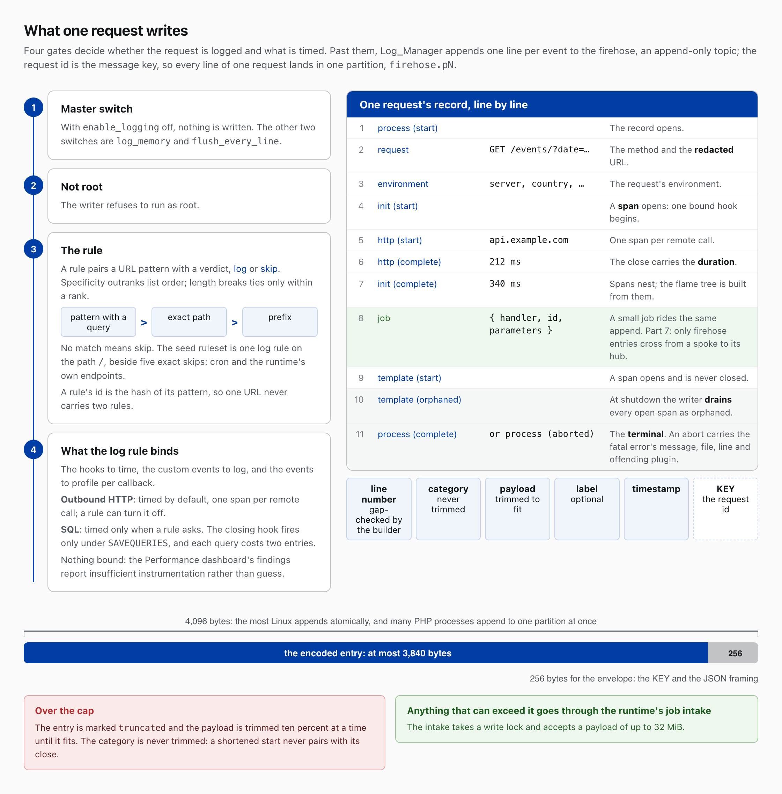
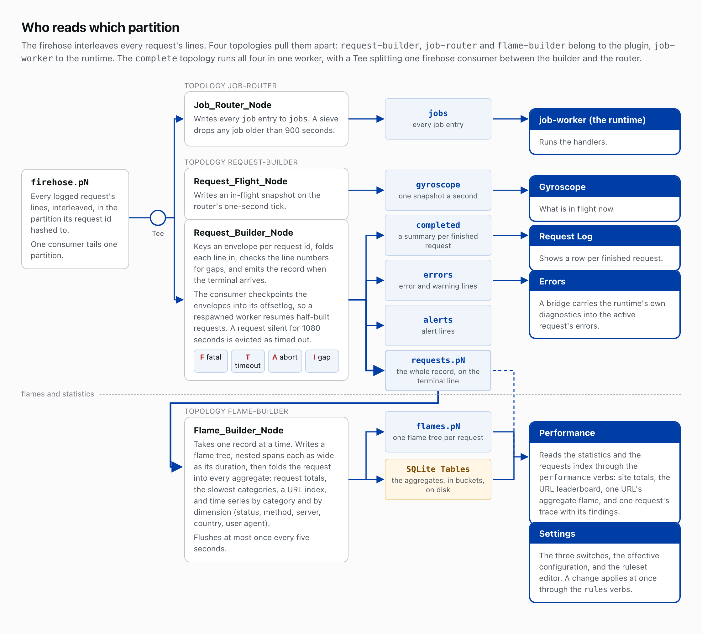

# The Event Logger

Newspack Event Logger Nodes is an application on the runtime: it records what a WordPress request does and how long each part takes. The runtime owns the wiring; the plugin owns the data processing.

## One line per event

The writer sits on the critical path of the request it measures. [Log_Manager](../includes/class-log-manager.php) appends one line per event to the firehose, an append-only topic, and forgets it: it reads nothing, aggregates nothing and waits on no other process.

Four gates stand before the append. `enable_logging` is the master switch. The writer refuses to run as root. A rule pairs a URL pattern with a verdict, log or skip, and specificity outranks list order: a pattern with a query beats an exact path, which beats a prefix, and length breaks ties only within a rank. No match means skip, so the seed ruleset is one log rule on `/`; cron and the runtime's own endpoints log as worker traffic rather than being skipped. A rule's id is the hash of its pattern, so one URL never carries two rules.

The fourth gate is what the log rule binds: the hooks to time, the custom events to log and the events to profile per callback. Outbound HTTP and SQL are timed only when a rule asks, through its `log_http` and `log_queries`: each remote call or query costs two entries, and a query's closing hook fires only under `SAVEQUERIES`. Where nothing is bound, the Performance dashboard's findings report insufficient instrumentation rather than guess.

A message carries a line number, a category, a payload, an optional label and a timestamp, keyed by the request id so one request's lines land in one partition. The record opens with a process start line, a request line naming the method and the redacted URL, and an environment line. Each timed operation is a span: a start line, then a complete line carrying the duration. At shutdown the writer drains every open span as orphaned and writes the terminal, process complete or process aborted, with any fatal error's message, file, line and offending plugin.

Linux appends atomically only up to 4,096 bytes, and many PHP processes append to one partition at once, so the writer holds each encoded entry to 3,840 bytes and leaves 256 for the key and the JSON framing. Over the cap, the entry is marked truncated and its payload trimmed ten percent at a time until it fits; the category is never trimmed, because a shortened start never pairs with its close. Anything that can exceed the cap belongs in the runtime's [job intake](https://github.com/Automattic/newspack-nodes/blob/v2.56.0/includes/class-job-intake.php), which takes a write lock and accepts up to 32 MiB.

## Assembling a request

The firehose interleaves every request's lines. Four topologies pull them apart: [request-builder](../topologies/request-builder.tsl), [job-router](../topologies/job-router.tsl) and [flame-builder](../topologies/flame-builder.tsl) in the plugin, [job-worker](https://github.com/Automattic/newspack-nodes/blob/v2.56.0/topologies/job-worker.tsl) in the runtime. One consumer tails one partition.

Assembly happens in the workers, where the request is over and nobody is waiting. [Request_Builder_Node](../includes/class-request-builder-node.php) keys an envelope per request id, folds each line in, checks the line numbers for gaps, and emits the record to the requests partition when the terminal arrives. A summary of each finished request goes to completed, error and warning lines to errors, and alert lines to alerts; [Request_Flight_Node](../includes/class-request-flight-node.php) writes an in-flight snapshot to gyroscope on the router's one-second tick. The consumer checkpoints the envelopes into its offsetlog, so a respawned worker resumes half-built requests, and a silent request is evicted as timed out after 1080 seconds at most. Four statuses mark an unclean end, F for a fatal, T for a timeout, A for an abort and I for a gap; they tell you whether a measurement is missing or the request was.

Gyroscope shows what is in flight now, Request Log a row per finished request, and Errors the error lines; a bridge carries the runtime's own diagnostics into the active request's errors. Settings holds the three switches, `enable_logging`, `log_memory` and `flush_every_line`, the effective configuration and the ruleset editor; a change applies at once through the `rules` verbs. [Dashboards](dashboards.md) covers what each one reads.

## Flames and statistics

[Flame_Builder_Node](../includes/class-flame-builder-node.php) takes one record from the requests partition at a time, writes a flame tree of nested spans, each as wide as its duration, to the flames partition, then folds the request into every aggregate: request totals, the slowest categories, the URL rows, and time series by category and by dimension (status, method, server, country, user agent). Performance reads the statistics and the requests index through the [`performance`](API.md#performance--the-omnibus-dashboard-ci) verbs: site totals, the URL leaderboard, one URL's aggregate flame, and one request's trace with its findings.

The aggregates live in nine SQLite Ledgers on the flame builder's host, one file each that every partition appends to. A row is written once, at the start of the five-minute bucket the request finished in, under a key [Stats_Store](../includes/class-stats-store.php) builds from the scope it counts — the site, a server, a dimension, a URL — and nothing ever updates it: each row is a delta, and a read adds every row it finds. The Ledgers keep sums and counts, never means, so buckets and partitions merge by addition and the dashboard divides at read time. Three bounds hold: past 128 servers in a day, a server's rows file under `Other`, so the totals still add up; a leaderboard category keeps its 50 slowest entries once it holds more than 100 in a bucket; and a URL's flame blob is capped to `Stats_Store::ITEM_BUDGET`, 900,000 bytes, before it is written.

The builder appends at the consumer's 30-second checkpoint: everything it folded since the last one goes out as one append per Ledger, and each Ledger keeps hourly segments, the retention window's worth and never fewer than 25, dropping the oldest whole. Each chart is one sum over the 288 five-minute buckets of the last 24 hours. The URL table is one ranked read, sorted in the Ledger by the column the page asks for, and a search looks a term's whole words up in a word index, filed once an hour for each URL it saw, then reads the rows of the URLs they name. A URL's flame and profile sit apart, in one SQLite Table per partition, for a twenty-fourth of the window.

## Durable statistics

The Ledgers and the Table are SQLite files under the runtime's base directory, so memcache failing or restarting costs the statistics nothing, and a row is deleted only when its segment ages out. A checkpoint between the 30-second ones carries what the builder has folded but not yet written, and the next 30-second checkpoint writes it once, so a respawned worker's replay counts nothing twice, except the double count [decision 37](architecture-decisions.md#decision-37-the-span-settles-at-the-interval-checkpoint-and-every-other-checkpoint-carries-it) accepts when a crash lands between a settle's appends and the checkpoint that commits them. The dashboards read the Ledgers in place, which ties them to the flame builder's host. Their keys carry no salt, so [`wp nodes memcache flush`](https://github.com/Automattic/newspack-nodes/blob/main/docs/cli.md) leaves the statistics alone; `wp nodes tables flush` naming the nine Ledgers and `flame-stats:url` starts them empty, and they fill again as traffic arrives.

## Jobs ride the firehose too

Jobs ride the firehose because the append is already paid for, and because only firehose entries cross from a spoke to its hub ([hub control](hub-control.md#jobs-from-a-spoke)). A job is an entry in the `job` category, so the same append that logs a request can enqueue work. [Job_Router_Node](../includes/class-job-router-node.php) writes every job entry to the jobs partition, a sieve drops any job older than 900 seconds, and the runtime's job-worker topology runs the handlers. The [`complete`](../topologies/complete.tsl) topology runs assembly, flames, routing and dispatch in one worker, with a Tee splitting one firehose consumer between the builder and the router.

## Read more

- [architecture-guide.md](architecture-guide.md), the sections [Write Path: Log_Manager](architecture-guide.md#write-path-log_manager), [Per-URL logging ruleset](architecture-guide.md#per-url-logging-ruleset), [Topologies](architecture-guide.md#topologies) and [Stats Schema](architecture-guide.md#stats-schema)
- [README.md](../README.md)
- [AGENTS.md](../AGENTS.md)
- [topologies/](../topologies)
